# Self-Attention-Assisted_TinyML_With_Effective_Representation_for_UWB_NLOS_Identification
를 따라해보면서 기록

논문에 언급된 방식들

dataset 7은 inference용으로 제외함.

### 0. 깃허브에 사용된 CNN
(https://github.com/tycheyoung/LOS-NLOS-Classification-CNN?tab=readme-ov-file)

**feature selection에 있어서 차이**  
본 논문은 fp_index를 기준으로 -2부터 +47까지 자름

하지만 해당 섹션은 데이터를 아래와 같은 코드를 이용해 잘랐다. 우선 아래 진행될 따라하기들도 같은 방식으로 자를 예정이다. 
하지만 마지막 6번은 Fp_index를 이용해서도 잘라 볼 것이다..
```python
Nnew=[]
for item in x_train:
    item = item[max([0,item.argmax()-50]) : item.argmax()+50] 
    #신호가 강한 구간 기준 앞 뒤로 50개씩 총100개 구간으로 자른다. 
    Nnew.append(item)
x_train = np.asarray(Nnew) 
# np.assary(): 리스트를 numpy배열로 변환하는 함수
```
또한 train, test, cv에 있어서 60,20,20이 아닌 25000개, 12000개, 5000개로 잘라서 사용했다.

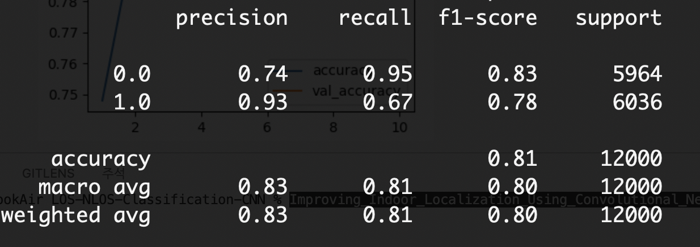 

### 1. CNN
참고논문: **Improving_Indoor_Localization_Using_Convolutional_Neural_Networks_on_Computationally_Restricted_Devices**

논문 참고사항

We reduced the dimensionality of
the CNN to accept 1-dimensional input traces in the form
of CIR data.

Sect 4.VI. NLOS CLASSIFICATION AND RANGING ERROR ESTIMATION USING CNN

A. CONVOLUTIONAL NEURAL NETWORK STRUCTURE

The activation function for each individual neuron in the
proposed CNN structure is a rectified linear unit (ReLU)
function.

** One of the functional layers in a CNN is a spatial reduc-
tion layer,where the output data of the previous layer are
down-sampled ** to minimize the effects of spatial positions of
detected features.  the max pooling spatial reduc-
tion function, which selects the maximum value of the values
covered within the current pooling window and propagates
it to the next layer.

** A good practice in CNNs is that the number of weights remains
constant throughout the entire neural network**
Following the spatial reduction layer, the number of weights can be kept constant with an adequate increase in the number of planes inside the convolutional layers.


In the case of NLoS classification, a readout layer con-
sists of two fully connected neurons with a softmax regres-
sion algorithm on neuron outputs. The first neuron predicts
the NLoS class, and the second neuron predicts the LoS
class. 

B. CNN TRAINING
Kingma and Ba  proposed a computationally efficient
stochastic optimization algorithm, Adam, that requires only
first-order gradients with little memory requirement, is invari-
ant to diagonal rescaling of the gradients and is suitable
for high-dimensional problems.

To prevent overfitting of a neural network to at least some
degree, dropout regularization is used to prevent complex
co-adaptations on the training data.(typically set 0.5)

In our case, rather than exposing the entire training
dataset to the trained neural network at once, smaller batches
of 256 randomly chosen samples are fed to the network during
consecutive learning iterations. 

C. FEEDING THE INPUT TO CNN
During the learning,
classification and regression processes, the first 152 CIR bins
are used, starting at the first path index bin detected by an
internal radio algorithm.

Sect 5.PERFORMANCE EVALUATION OF CLASSIFICATION AND LOCALIZATION
Performance evaluation of the proposed CNN structures
for NLoS classification and ranging error regression was
performed using different subsets of data collected during
the measurement campaign, as described in Sect 4, and
as was used for the training of CNN models to prevent
biased or overly optimistic results.

A. NLOS CLASSIFICATION PERFORMANCE COMPARISON

The MLP neural network (NN) was defined as a 3-layer
MLP with one hidden layer, where the input layer has
6 neurons, the hidden layer has 152 neurons and the output
layer has one neuron. The selected neural activation function
was rectified linear unit (ReLU). The structure was
trained using the stochastic gradient descent (SGD) optimiza-
tion algorithm with an adaptive learning rate, initial learning
rate lr=0.1, stopping condition tol=10^(-7), and initial
network synapses set to random values.

B. LOCALIZATION PERFORMANCE OF DIFFERENT APPROACHES
In all cases, error mitigation was
performed using the proposed CNN-based NLoS classifica-
tion and error regression models.

VIII. COMPUTATIONAL PERFORMANCE EVALUATION
We selected TF for implementation of CNN

B.Performance test definition

First, 152 bins from the indicated first path index inside
the individual range estimate CIR accumulator are taken and
added to the test dataset array. Next, a test algorithm measures
the time for executing 1000 classification iterations with suc-
cessively increasing sample batch sizes. Sample batch sizes
increase with 2n, where n goes from 0 to 11, i.e., holding from
1 to 2048 samples.
ㅌ


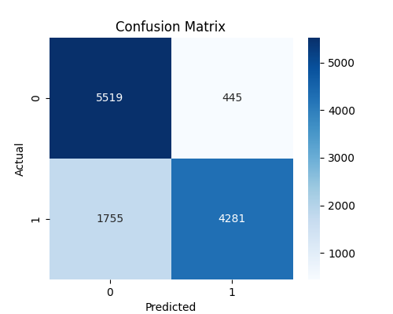
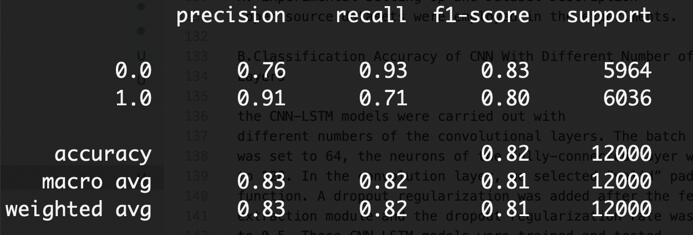

### 2. CNN-LSTM
IV. DATASET AND EXPERIMENTAL RESULTS
A. Experimental Setting Up and Dataset Description
 open source datasets were employed in the experiments. 

#### B.Classification Accuracy of CNN With Different Number of
Layers

the CNN-LSTM models were carried out with
different numbers of the convolutional layers. The batch size
was set to 64, the neurons of the fully-connected layer was set
to 128. In the convolution layer, we selected “valid” padding
function. A dropout regularization was added after the feature
extraction module and the dropout regularization rate was set
to 0.5. These CNN-LSTM models were trained and tested
for searching the best number of the layers. The input vector
dataset was the CIR data with the size (1×1016). These CNNs
were trained with 10 epochs, the training and testing dataset
was described in Section IV. A.


위의 사진을 참고하여 1,2,3,4층 별도로 코드를 짰음.

For the filters,
we mean Conv(p, q) a convolution layer with p filters and q
kernel size, and we mean the MaxPooling(a, b) with a pooling
size and b strides. 


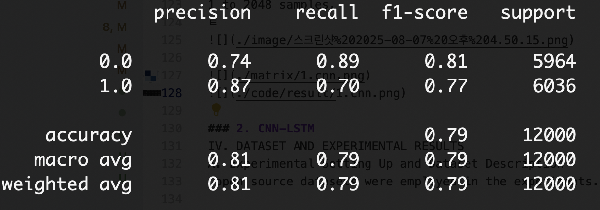

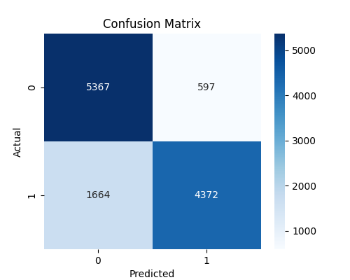
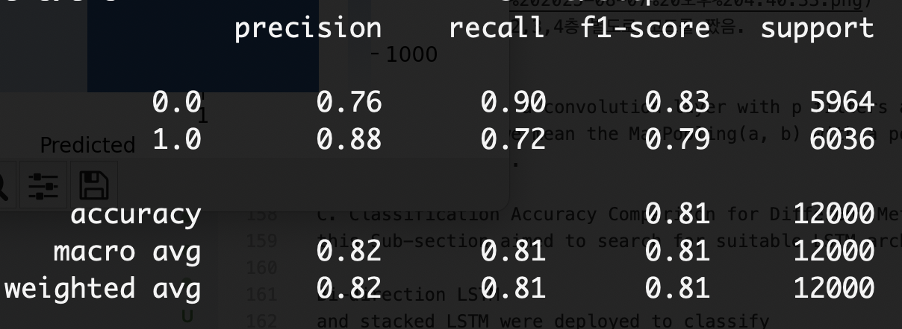


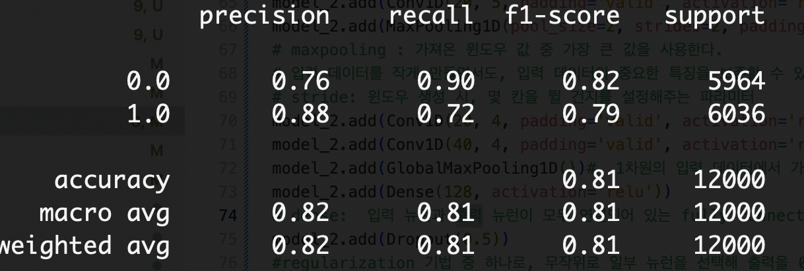


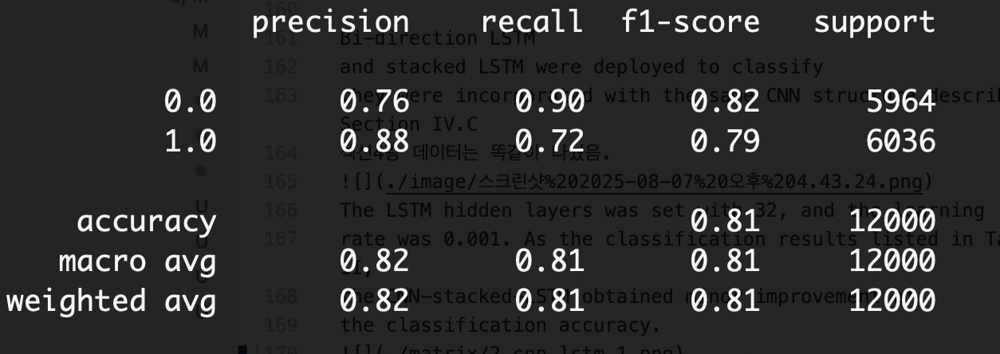

논문에서 CNN + LSTM 구조는 사용했다고만 명시되어 있고, 구체적인 레이어 구성은 생략되어 있어서, 동일한 CNN 구조(Section IV.C 참고)에 LSTM 계열 아키텍처(CNN-LSTM, CNN-Stacked-LSTM, CNN-BiLSTM)를 일반적인 방식에 따라 구현했습니다. 논문에서 언급한 하이퍼파라미터(예: LSTM hidden size = 32, learning rate = 0.001 등)는 그대로 반영했고, 학습/테스트 데이터셋도 동일하게 구성했습니다.

#### C. Classification Accuracy Comparison for Different Methods
this Sub-section aimed to search for suitable LSTM architectures

Bi-direction LSTM
and stacked LSTM were deployed to classify
they were incorporated with the same CNN structure described in Section IV.C
섹션4랑 데이터는 똑같이 나눴음.

The LSTM hidden layers was set with 32, and the learning
rate was 0.001. As the classification results listed in Table II,
the CNN-stacked-LSTM obtained minor improvement of
the classification accuracy. However, the CNN-bidirectional-
LSTM performed a slightly worse in the classification accu-
racy, which might be initialed by the fact that the bidirectional LSTM had more parameters needed to be determined during the training phase.
성능이 가장 좋았던 2개의 CNN을 사용한 모델에서, LSTM , CNN+bidirectional-LSTM, CNN+stacked-LSTM으로 나누어 진행해보았음.

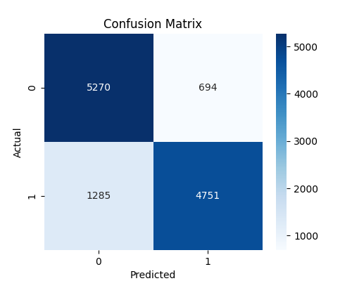
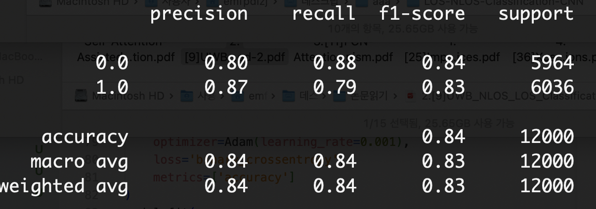

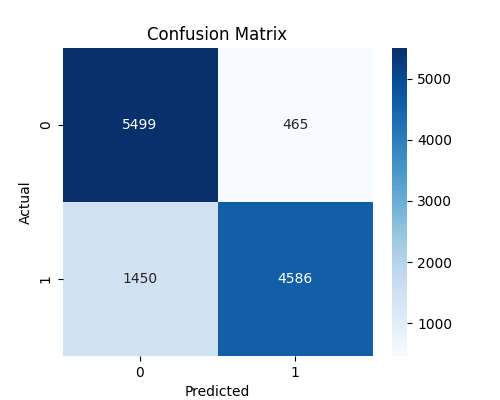
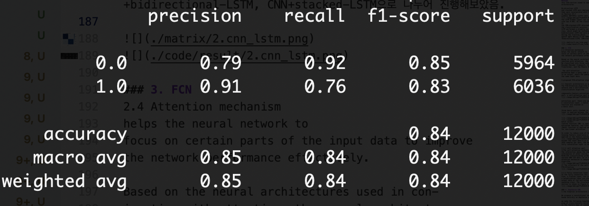


### 3. FCN
2.4 Attention mechanism
helps the neural network to
focus on certain parts of the input data to improve
the network performance effectively. 

Based on the neural architectures used in con-
junction with attention, the neural architectures can
be classified into three categories, They are the Encoder-Decoder framework, the
Transformer, and the Memory Networks. 

 The self-attention
mechanism maps a query and a set of key-value pairs
to an output, where the query, keys, values are from
the same input data.

3.proposed FCN-attention algorithm

3.1 Overall architecture or proposed algorihtm
The FCN-Attention algorithm is based on the FCN
network and a self-attention part is added to build the
classification algorithm

components:feature extraction
part, a self-attention part and a fully connection part.


extraction part  there are multiple unit.
A convolution layer, a batch normal ization layer and a ReLU function are stacked as
a basic unit.

three basic units stacked in the FCN network and a maxpooling layer is applied between the second and third basic units.


batch normal-
ization function (BN) is applied for generalizing the
extracted features, and finally a Rectified Linear Units
(ReLU) function is applied on the results from the BN
for non-linear activation 

In order to reduce size of feature data while main-
taining feature invariance a maxpooling function is
applied in the feature extraction part. 

Assume the input data X is a CIR data which has
1016 samples per data, the detail parameters of the
fully convolution layer is shown in image

3.2.2 self attention part
1)The self-attention mechanism focus on extracting
the interaction among the input features without prior
information of other source, which is also suitable for
NLOS/LOS classification problem using only the uni-
variate UWB CIR data. So in this paper the self-
attention mechanism is adopted in the proposed
algorithm.

2) The structure of the self-attention adopted for
FCN-Attention


3.2.3 Fully connection layer
In the fully connection sec-
tion, a flatten layer, two Linear layers, a dropout layer,
a normalization layer are stacked for projecting the
output data of the self-attention layer to its corre-
sponding class. The structure of the fully connection
section is shown in Figure 4.


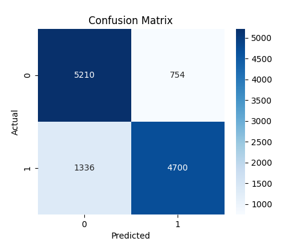
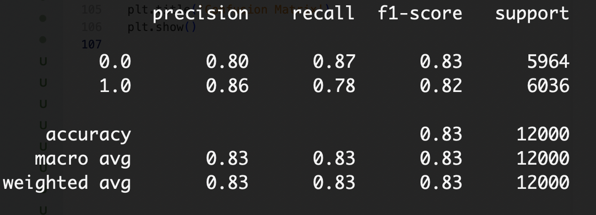

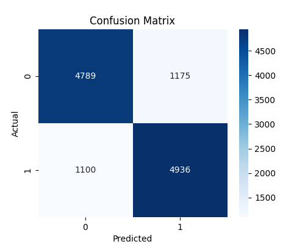
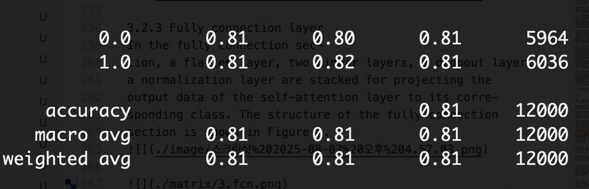

**그런데 논문 결과와 다르게 cnn-lstm>fcn>fcnattention 이게나옴..
fcn 논문에서 pytorch를 사용하긴 했지만 그래도 이럴 수 있나?-> 추후 생각좀 해봐야할듯?**

FCN-LSTM: LSTM Fully Convolutional Networks for Time Series Classification

- The proposed model augments a Fully Convolutional Network (FCN) with an LSTM block.
- The FCN block consists of three stacked temporal convolutional layers with 128, 256, and 128 filters, each followed by Batch Normalization and ReLU activation.
- After the convolutional blocks, Global Average Pooling (GAP) is applied to reduce the number of parameters.
- In parallel, the same input is passed to an LSTM block, preceded by a dimension shuffle layer:
- This layer transforms the input sequence from shape (timesteps, 1) to (1, timesteps) so that LSTM treats it as a multivariate time series with 1 timestep, rather than a long univariate time series.
- This improves training efficiency and generalization, especially for short sequences or small datasets.
- The outputs of the GAP layer (from FCN) and the LSTM block are concatenated, and passed to a Dense (Softmax) layer for classification.
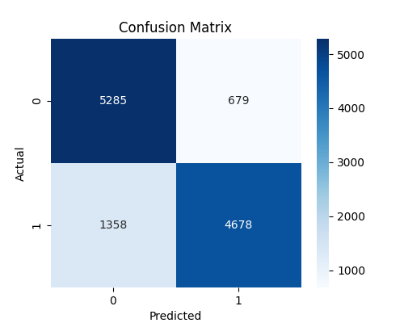
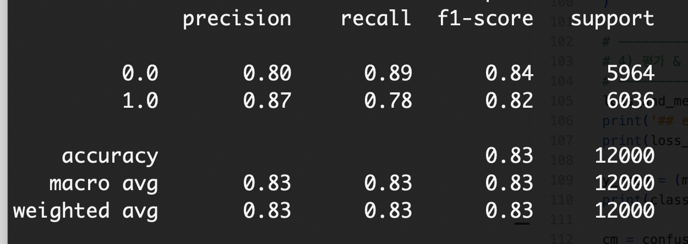

### 4. Depthwise CNN
3.the Xception architecture (Extreme inception)

We propose a convolutional neural network architecture
based entirely on depthwise separable convolution layers.

we make the following hypothesis: that the map-
ping of cross-channels correlations and spatial correlations
in the feature maps of convolutional neural networks can be
entirely decoupled. 


The Xception architecture has
36 convolutional layers forming the feature extraction base
of the network. In our experimental evaluation we will ex-
clusively investigate image classification and therefore our
convolutional base will be followed by a logistic regression
layer. Optionally one may insert fully-connected layers be-
fore the logistic regression layer, which is explored in the
experimental evaluation section.The 36 convolutional layers are structured into
14 modules, all of which have linear residual connections
around them, except for the first and last modules.

In short, the Xception architecture is a linear stack of
depthwise separable convolution layers with residual con-
nections. This makes the architecture very easy to define
and modify

An open-source implementation of
Xception using Keras and TensorFlow is provided as part of
the Keras Applications module2, under the MIT license.


++To our knowledge, there are currently no specific reports
on the use of a Depthwise CNN-based strategy for UWB
NLOS identification. In this article, Depthwise CNN, an improved strategy of conventional CNN methods, is compared
and validated against the proposed method under the same
conditions.

** quantization에 대한 설명은 4번 논문에 구체적으로 없어서, 그냥 본 논문에 있는 방식대로 해보기로함. **
-A) 가중치만 int8(Dynamic Range, activations=float32)
B) 완전 int8(Full-INT8, rep. 500샘플 캘리브레이션)

### 5. MLP (논문에 같이 언급됨)
This strategy is the pretrained classifier model used in this article, as shown
in Fig. 4(a). 

Note: Strategy 4 and Strategy 5 are additional baselines
designed in this article, aiming to accelerate edge inference
under resource-constrained conditions with minimal parameter
count. With the developed feature selection method, strategy
5, namely, MLP, can even outperform all the performance of
summarized baseline strategies on the PC side. Among the
numerous baselines, strategy 4 (Depthwise CNN) and strategy
5 (MLP) described above are the best-performing with the
fewest parameters
### 6. 해당 논문 방식 
3. method design


1)feature selection
중요한 CIR 특징들은 FP_INDEX 기준으로 전후 50개 구간에 밀집되어 있는 경향이 있으며, 이 논문에서는 계산 복잡도를 줄이기 위해, FP_INDEX−2에서 FP_INDEX+47까지의 총 50개 시퀀스 구간만을 추출하여 사용 

data set is randomly split into three
parts: 1) training set; 2) validation set; and 3) test set, with
proportions of 60%, 20%, and 20%,

2)algorithm design

self-attention


In this study, a self-attention-assisted method is devised to
strengthen the representation ability of UWB NLOS identifi-
cation in the pretrained classifier model


In Fig. 4, the pretrained classifier model is represented
in (a), while the retrained self-attention-assisted classifier
network is depicted in (b). As illustrated in (a), the pretrained
model comprises five fully connected (FC) layers and three
batch normalization (BN) layers. The activation function of the
first FC layer is linear, and the second FC layer is responsible
for extracting abstract features from the input data.

In (b), the first three layers are frozen to preserve the pre-
extracted feature representations, which are utilized by the
self-attention-assisted classifier network for UWB NLOS iden-
tification.

During the retraining process, the size of the retrained
classifier network was trimmed to an appropriate amount to
optimize the overall computational resource consumption com-
pared to the pretrained model. Subsequently, while keeping
the first three layers of the pretrained network frozen, the
self-attention and new classifier in (b) are considered as a
new model to be retrained. The Adam optimizer was used
for training the self-attention-assisted classifier network, and
the cross-entropy method was used as the loss function. The
batch size was set to 256 and the number of epochs was 350.
The details of these two models, including model structures,
parameter sizes, and activation functions, are presented in
Fig. 4.

3)quantization and deployment.

a.model compression :TFLM

b.model quantization: 

In practice, it has been
observed that using the “int8” format to store weights and
activation values can produce inference results almost identical
to those of “float32” models 

However, converting the parameters in the com-
pressed models from “float32” format to “int8” format is not
a straightforward task. One reliable solution is to employ the
PTQ strategy, where weights are quantized to “int8” values
while the activation layers still use the “float32” format. This
reduces the model file size to 1/4 of its original size and
improves inference speed.

To ensure accurate quantization of
activation layers, a calibration set consisting of 500 samples
is used in this article. 

c.model deployment
As an alternative, the TFlite file
can be converted into a C/C++ source code file


